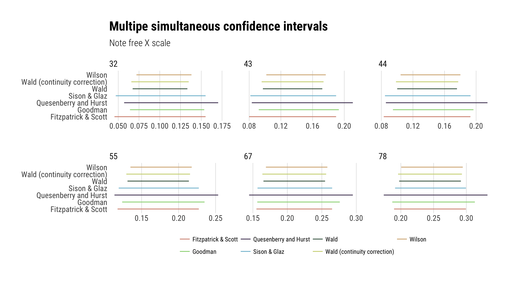

[](https://travis-ci.org/hrbrmstr/scimple) [](https://codecov.io/github/hrbrmstr/scimple?branch=master)

`scimple` : Tidy Simultaneous Confidence Intervals for Multinomial Proportions

This is a tidy version of the `CoinMinD` R package with some extra bits tossed in for good measure.

The following functions are implemented:

-   `scimple_ci`: Calculate multiple simultaneous confidence intervals using selected methods (excluding Bayesian methods)
-   `scimp_bmde`: Bayesian Multinomial Dirichlet Model (Equal Prior)
-   `scimp_bmdu`: Bayesian Multinomial Dirichlet Model (Unequal Prior)
-   `scimp_fs`: Fitzpatrick & Scott Confidence Interval
-   `scimp_goodman`: Goodman Confidence Interval
-   `scimp_qh`: Quesenberry & Hurst Confidence Interval
-   `scimp_sg`: Sison & Glaz Confidence Interval
-   `scimp_wald`: Wald Confidence Interval
-   `scimp_waldcc`: Wald Confidence Interval (with continuity correction)
-   `scimp_wilson`: Wilson Confidence Interval

There's also a handy named vector `scimple_short_to_long` which you can use to expand shorthand method names (e.g. "sg") to long (e.g. "Sison & Glaz").

### Installation

``` r
devtools::install_github("hrbrmstr/scimple")
```

### Usage

``` r
library(scimple)
library(hrbrthemes)
library(tidyverse)

# current verison
packageVersion("scimple")
```

    ## [1] '0.1.0'

``` r
y <- c(44, 55, 43, 32, 67, 78)
z <- 0.05

scimple_ci(y, z) %>% 
  mutate(method=scimple_short_to_long[method]) -> cis

print(cis)
```

    ## # A tibble: 42 × 8
    ##                 method lower_limit upper_limit     adj_ll    adj_ul   volume inpmat alpha
    ##                  <chr>       <dbl>       <dbl>      <dbl>     <dbl>    <dbl>  <dbl> <dbl>
    ## 1  Fitzpatrick & Scott  0.08306258   0.1927995 0.08306258 0.1927995 1.75e-06     44  0.05
    ## 2  Fitzpatrick & Scott  0.11754534   0.2272823 0.11754534 0.2272823 1.75e-06     55  0.05
    ## 3  Fitzpatrick & Scott  0.07992778   0.1896647 0.07992778 0.1896647 1.75e-06     43  0.05
    ## 4  Fitzpatrick & Scott  0.04544502   0.1551819 0.04544502 0.1551819 1.75e-06     32  0.05
    ## 5  Fitzpatrick & Scott  0.15516289   0.2648998 0.15516289 0.2648998 1.75e-06     67  0.05
    ## 6  Fitzpatrick & Scott  0.18964565   0.2993826 0.18964565 0.2993826 1.75e-06     78  0.05
    ## 7              Goodman  0.09468368   0.1966413 0.09468368 0.1966413 1.55e-06     44  0.05
    ## 8              Goodman  0.12376893   0.2350489 0.12376893 0.2350489 1.55e-06     55  0.05
    ## 9              Goodman  0.09208527   0.1931040 0.09208527 0.1931040 1.55e-06     43  0.05
    ## 10             Goodman  0.06412671   0.1535697 0.06412671 0.1535697 1.55e-06     32  0.05
    ## # ... with 32 more rows

``` r
ggplot(cis) +
  geom_segment(aes(x=lower_limit, xend=upper_limit, y=method, yend=method, color=method)) +
  scale_color_ipsum(name=NULL) +
  facet_wrap(~inpmat, scales="free_x") +
  labs(x=NULL, y=NULL, 
       title="Multipe simultaneous confidence intervals",
       subtitle="Note free X scale") +
  theme_ipsum_rc(grid="X", base_size=11) +
  theme(legend.position="bottom")
```



### Test Results

``` r
library(scimple)
library(testthat)

date()
```

    ## [1] "Sat Mar  4 00:16:16 2017"

``` r
test_dir("tests/")
```

    ## testthat results ========================================================================================================
    ## OK: 16 SKIPPED: 0 FAILED: 0
    ## 
    ## DONE ===================================================================================================================
