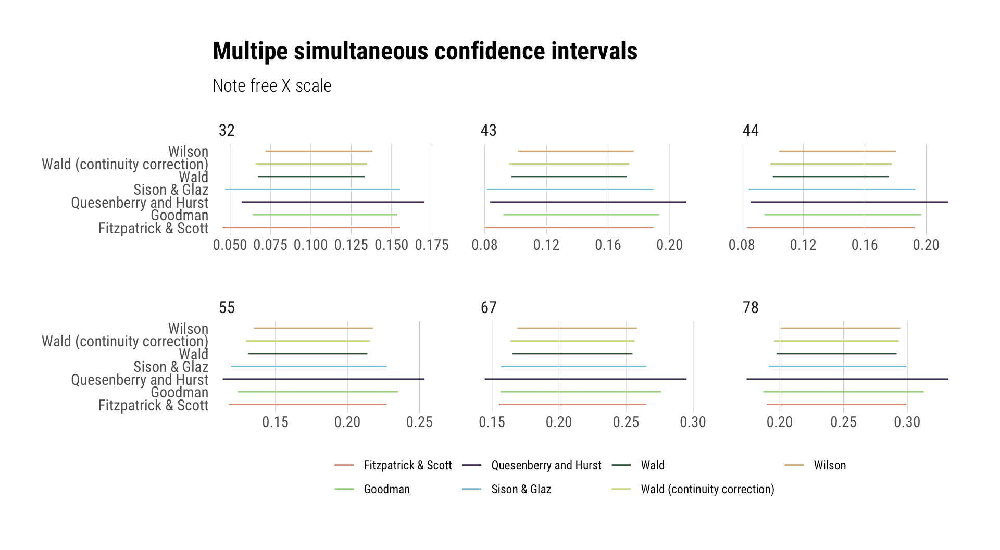

[](https://www.repostatus.org/#active)
[](https://keybase.io/hrbrmstr)

[](https://travis-ci.org/hrbrmstr/scimple)
[](https://codecov.io/gh/hrbrmstr/scimple)


# scimple

Tidy Simultaneous Confidence Intervals for Multinomial Proportions

## Description

Methods for obtaining simultaneous confidence intervals for multinomial
proportions have been proposed by many authors and the present study
include a variety of widely applicable procedures. Seven classical
methods (Wilson, Quesenberry and Hurst, Goodman, Wald with and without
continuity correction, Fitzpatrick and Scott, Sison and Glaz) and
Bayesian Dirichlet models are included in the package. The advantage of
MCMC pack has been exploited to derive the Dirichlet posterior directly
and this also helps in handling the Dirichlet prior parameters. This
package is prepared to have equal and unequal values for the Dirichlet
prior distribution that will provide better scope for data analysis and
associated sensitivity analysis.

## What’s Inside The Tin

The following functions are implemented:

  - `scimp_bmde`: Bayesian Multinomial Dirichlet Model (Equal Prior)
  - `scimp_bmdu`: Bayesian Multinomial Dirichlet Model (Unequal Prior)
  - `scimp_fs`: Fitzpatrick & Scott Confidence Interval
  - `scimp_goodman`: Goodman Confidence Interval
  - `scimp_qh`: Quesenberry & Hurst Confidence Interval
  - `scimp_sg`: Sison & Glaz Confidence Interval
  - `scimp_wald`: Wald Confidence Interval
  - `scimp_waldcc`: Wald Confidence Interval (with continuity
    correction)
  - `scimp_wilson`: Wilson Confidence Interval
  - `scimple_ci`: Calculate multiple simultaneous confidence intervals
    using selected methods (excluding Bayesian methods)
  - `scimple_short_to_long`: Simple tranlsation table from method
    shorthand to full method name

There’s also a handy named vector `scimple_short_to_long` which you can
use to expand shorthand method names (e.g. “sg”) to long (e.g. “Sison &
Glaz”).

### Installation

Package installation:

``` r
remotes::install_gitlab("hrbrmstr/scimple")
# or
remotes::install_github("hrbrmstr/scimple")
```

NOTE: To use the ‘remotes’ install options you will need to have the
[{remotes} package](https://github.com/r-lib/remotes) installed.

### Usage

``` r
library(scimple)
library(hrbrthemes)
library(tidyverse)

y <- c(44, 55, 43, 32, 67, 78)
z <- 0.05

scimple_ci(y, z) %>% 
  mutate(method=scimple_short_to_long[method]) -> cis

print(cis)
## # A tibble: 42 x 8
##    method              lower_limit upper_limit adj_ll adj_ul     volume inpmat alpha
##    <chr>                     <dbl>       <dbl>  <dbl>  <dbl>      <dbl>  <dbl> <dbl>
##  1 Fitzpatrick & Scott      0.0831       0.193 0.0831  0.193 0.00000175     44  0.05
##  2 Fitzpatrick & Scott      0.118        0.227 0.118   0.227 0.00000175     55  0.05
##  3 Fitzpatrick & Scott      0.0799       0.190 0.0799  0.190 0.00000175     43  0.05
##  4 Fitzpatrick & Scott      0.0454       0.155 0.0454  0.155 0.00000175     32  0.05
##  5 Fitzpatrick & Scott      0.155        0.265 0.155   0.265 0.00000175     67  0.05
##  6 Fitzpatrick & Scott      0.190        0.299 0.190   0.299 0.00000175     78  0.05
##  7 Goodman                  0.0947       0.197 0.0947  0.197 0.00000155     44  0.05
##  8 Goodman                  0.124        0.235 0.124   0.235 0.00000155     55  0.05
##  9 Goodman                  0.0921       0.193 0.0921  0.193 0.00000155     43  0.05
## 10 Goodman                  0.0641       0.154 0.0641  0.154 0.00000155     32  0.05
## # … with 32 more rows

ggplot(cis) +
  geom_segment(aes(x=lower_limit, xend=upper_limit, y=method, yend=method, color=method)) +
  scale_color_ipsum(name=NULL) +
  facet_wrap(~inpmat, scales="free_x") +
  labs(x=NULL, y=NULL, 
       title="Multipe simultaneous confidence intervals",
       subtitle="Note free X scale") +
  theme_ipsum_rc(grid="X", base_size=11) +
  theme(legend.position="bottom")
```



## scimple Metrics

| Lang | \# Files |  (%) | LoC |  (%) | Blank lines |  (%) | \# Lines |  (%) |
| :--- | -------: | ---: | --: | ---: | ----------: | ---: | -------: | ---: |
| R    |       16 | 0.94 | 438 | 0.95 |         104 | 0.85 |      185 | 0.86 |
| Rmd  |        1 | 0.06 |  23 | 0.05 |          19 | 0.15 |       29 | 0.14 |

## Code of Conduct

Please note that this project is released with a Contributor Code of
Conduct. By participating in this project you agree to abide by its
terms.
